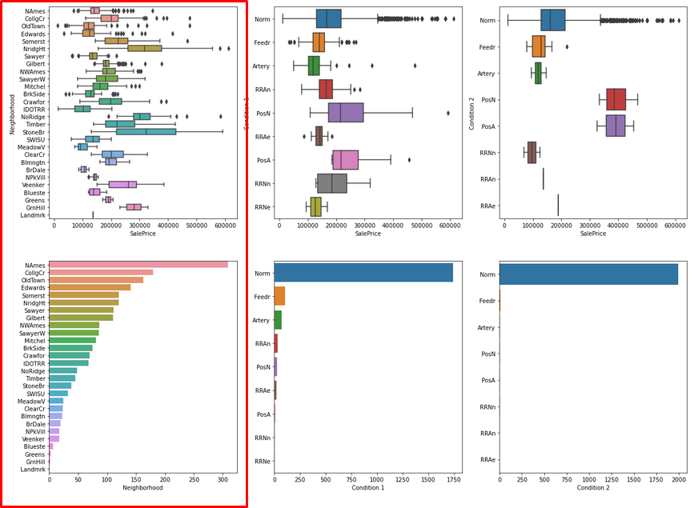
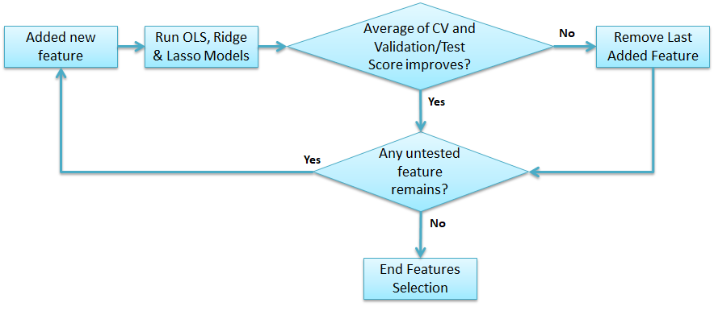

### Content
- [Background](#Background)
- [Problem Statement](#Problem-Statement)
- [Cleaning of Data](#Cleaning-of-Data)
- [EDA](#EDA)
- [Feature Selection](#Feature-Selection)
- [High RMSE Observed on Cross-Validation on Final Model](#High-RMSE-Observed-on-Cross-Validation-on-Final-Model)
- [Top 5 Most Influencing Features](#Top-5-Most-Influencing-Features)
- [Conclusions](#Conclusions)
- [Business Recommendations](#Business-Recommendations)

### Background
Ames is a city in the state of Iowa in United States which is the ninth largest state in 2020. In the city, Iowa State University accounts for about 50% of the city population. The housing price dataset which is used for the analysis below contains sale price of houses sold, along with their features, from 2006 to 2010 ([*source 1*](https://en.wikipedia.org/wiki/Ames,_Iowa), [*source* 2](https://medium.com/@hjhuney/quantitative-data-exploration-for-regression-in-python-ames-housing-part-1-25879dd4cc4a)).

 

### Problem Statement
New buyers of residential properties are usually unfamiliar with the market prices. Depending on criterias such as locations, amenities, lot size and livable area, the price can varies greatly. As a data scientist, you would like to help buyers to determine the reasonable selling price for residential properties so that they are not over-paying for them and know when a property is a good deal.
Your tasks are:-
- Create a model to predict the sale price based on the features provided in the Ames Housing Dataset
- Identify the top 5 features which would greatly influence the price which the buyers should take note of

 

### Cleaning of Data
Most of the features provided in the data set are complete except for the following features:-
- Lot Frontage (330)
- Garage Year Built (114)

#### Imputing Garage Year Built
As majority of the houses built had the garage built during the same year, the missing data were imputed by assuming those garages were built in the same year.

After imputing the data, the distribution before and after imputation were compared. In summary, while there is a change in the distribution, the change is small.

#### Imputing Lot Frontage
Looking at the scatterplot of the Lot Frontage vs Lot Area, it is observed that Lot Frontage has a linear relationship with Lot Area when Lot Area is less than 300,000. 

|Original Plot|Plot when Lot Area < 300,000|
|:----:|:----:|
|||

For Lot Area more than 300,000, the relationship is unclear as there is a lack of data. Hence the decision is to use the data where lot area is less than 300,000 and use it to create a linear model between Lot Area and Lot Frontage to impute the missing Lot Frontage data where the Lot Area is less than 300,000.

After imputing the Lot Frontage missing row data, the Lot Frontage distribution is taller but the mean is very close to the original distribution.

#### Removing NA rows
As the remaining missing row data accouts for less than 5% (~1.9%) of the total sample size, the decision was made to drop those rows instead.

#### Abnormalities In Data
It was observed that some numeerical features did not match its categorical features. For example, under House Style, some of the 1Story houses have values for 2nd Flr SF.

Similarly. despite labelled as not having Mas Vnr, some of the houses has non-zero values for Mas Vnr Area. 

In these cases, such data were assigned 0 to match the categorical features.

### EDA
As the features were separated to categorical and numeric features, different visualizations were used to find trends. For numeric features, correlation heatmap and scatterplot were mainly used while for categorical data, boxplots were used.

Apart from the original features, 8 new features were created and evaluated. These 8 features are:-

|New Feature Names|Definition|
|:----:|:----:|
|Total SF|Total Bsmt SF + 1st Flr SF + 2nd Flr SF|
|Total SF\**2| Square of Total SF|
|No Of Bath|Sum of Bsmt Full Bath + Bsmt Half Bath/2 + Full Bath + Half Bath|
|Total Porch SF|Open Porch SF + Enclosed Porch + 3Ssn Porch + Screen Porch|
|Amenities SF|Pool Area + Wood Deck SF + Garage Area|
|Age_Sold|Yr Sold + Year Built|
|Remod/Add Age_Sold|Yr Sold - Year Remod/Add|
|Gr Liv Area\**2|Square of Gr Liv Area|

For the numerical features, the selection criteria are to look for features with high correlation coefficients with SalePrice with little outliers. Examples of such features are Age_Sold, Total SF, Gr Liv Area.

|Age_Sold vs SalePrice|Total SF vs SalePrice|Gr Liv Area vs SalePrice|
|:----:|:----:|:----:|
||||

However while some of the features have high correlation score and little outliers, the location of the outliers can cause issue for the model as well. For example, the pairplot of the floors SF vs the SalePrice, we can observe that Total Bsmt, 1st Flr SF, Total SF and Lot Area has data points that are far away from the populaton. These should be taken note of in case the model is not performing well.

For categorical features, the criteria are to ideally have significantly different median or mean for each labels of the features. Reason being that after one hot encoding, those newly created features using those labels would have linear relationship with SalePrice. If the median or mean of each feature_labels are similar to each other, after one hot encoding, those new features would not help the model to differentiate one feature from another feature, and hence cannot predict the SalePrice accurately. Examples of good categorical features to use in the linear regression model are as Overall Qual, Overall Cond, Neighborhood, MS SubClass and MS Zoning.

### Feature Selection
From the EDA, using the selection criteria, 41 features were selected. To decide which features are useful for the model in predicting the SalePrice, 3 models (Ordinary least square, ridge and lasso) were used. As some of the features are colinear to each other, care was made to ensure that they were not used concurrently in the final model.

The approach to train the model is to start with using all numerical features and check if it resulted in high bias or high variance and which features had zero or low coefficients.

From the coefficient bar chart, it is noted that the coefficients of features used to create engineered features are zero. As such, in subsequent models, these features were not included.

Next, categorical features were slowly added one at a time. The approach to selecting the categorical features are to check with each new feature added, what is the R2 and RMSE score. If adding the new feature results in better score, the feature is retained. However, if the score becomes worse, the feature is removed. The flowchart for this appraoch is as shown below.

At the end of the feature selection, only 22 features were used in the model.

### High RMSE Observed on Cross-Validation on Final Model
For each model, it was routinely observed that the CV score is always significantly higher than the train and validation score. As shown in the table below for the model which used the final 22 selected features, the CV is about 3000 higher than train and 6000 higher than validation.

||Ridge R2|Lasso R2|Ridge RMSE|Lasso RMSE|
|:---:|:---:|:---:|:---:|:---:|
|Train|0.8940|0.8940|26231.5331|26225.0161|
|CV|0.8590|0.8594|29799.9260|29755.5313|
|Validation|0.8932|0.8933|23825.1331| 23818.0141|

Taking a deeper dive into the residual plot, it is observed that there are some points with very high residual.

Tracing these 2 points back to the data source, it was observed that these 2 points had a low SalePrice despite very high 1st Flr SF (more than 4500) which was initially noted in the EDA. However, as there was no sufficient reason to remove these outlier points, they were not removed during the early phase.

However, with the removal of these 2 points, the score of the model improved and hence it was decided that the production model would not be trained using the 2 outlier points and the model might only be accurate for predicting SalePrice of houses with 1st Flr SF less than 4500.

||Pre-Filter Ridge R2|Post-Filter Ridge R2|Pre-Filter Ridge RMSE|Post-Filter Ridge  RMSE|
|:---:|:---:|:---:|:---:|:---:|
|Train|0.8940|0.9244|26231.5331|21891.4135|
|CV|0.8590|0.9080|29799.9260|24020.8786|
|Validation|0.8932|0.9225|23825.1331|21420.7445|

### Top 5 Most Influencing Features
The top 5 features were selected based on if the labels of the feature appeared in the top 20 graph below.

These features are:-
- Overall Qual
- Total SF
- Kitchen Qual
- Age Sold
- MS SubClass

### Conclusions
In general, when selecting features for training the model, numerical features should have high absolute correlation score with the SalePrice with as little outliers as possible, while categorical features should have significantly different mean or median. These criteria are to allow the linear model better predict the SalePrice.

### Business Recommendations

Apart from the usual factor such as total floor area and age of the house, a buyer has to take note of the build quality (material and finish) of the house as well. By getting a house with overall quality rated 5 and above will cause the SalePrice to increase by at least USD 12,500. Lastly, the buyer should take note of the quality of the kitchen. Any kitchen that is below excellent would cause the price to decrease by a few thousands dollars. 

Should the buyer managed to find a house that costs lower than what the model predicted, he/she should consider buying it either for investment/rental or for living in. On the other hand, if the house costs more than what the model predicted, the SalePrice should be negotiated.